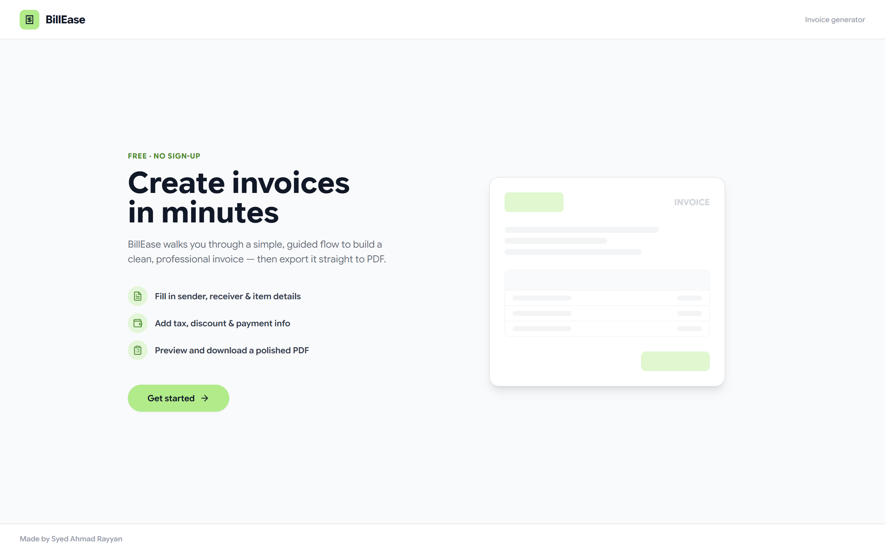
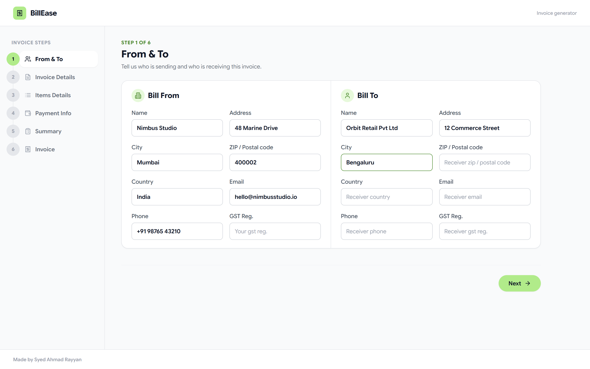
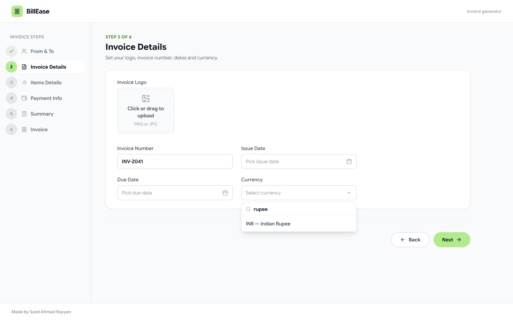
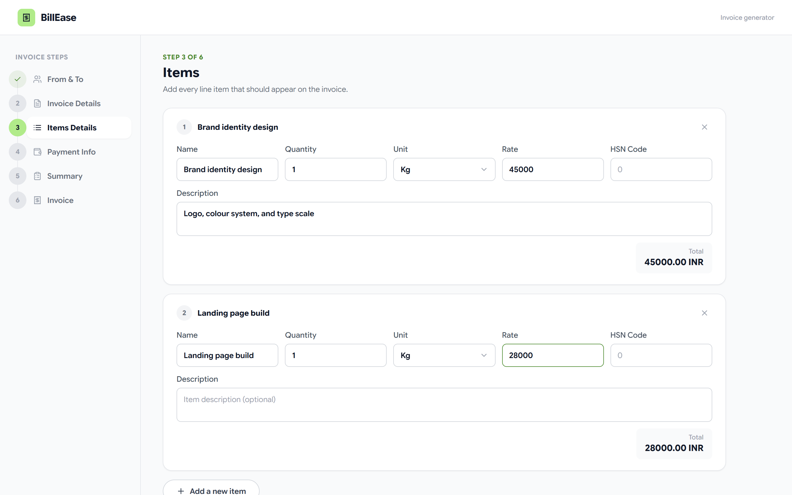
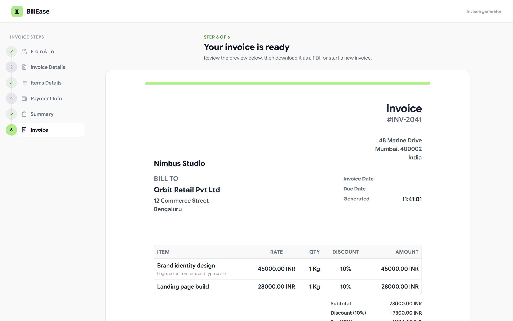

<p align="center">
  
</p>

<h3 align="center">A guided, six-step invoice generator that exports straight to PDF — no sign-up, no backend.</h3>

<p align="center">
  
  
  
  
  
  
</p>

<p align="center">
  <a href="#-features">Features</a> ·
  <a href="#-screenshots">Screenshots</a> ·
  <a href="#-tech-stack">Tech Stack</a> ·
  <a href="#-getting-started">Getting Started</a> ·
  <a href="#-project-structure">Project Structure</a> ·
  <a href="#-roadmap">Roadmap</a>
</p>

---

**BillEase** walks you through building a clean, professional invoice in six short steps — sender & receiver details, invoice metadata, line items, payment info, and a summary — then renders a polished, print-ready preview you can export as a PDF in one click. Everything runs entirely in the browser: no account, no server, no database.

## ✨ Features

- 🧭 **Guided 6-step wizard** — From & To → Invoice Details → Items → Payment Info → Summary → Invoice, with a live progress stepper that checks off completed steps as you go
- 💱 **Live currency list** — the currency picker is backed by a free exchange-rate API (166+ ISO currencies), with names resolved locally via `Intl.DisplayNames` and a graceful offline fallback
- 🔍 **Searchable dropdowns** — a custom combobox component (trigger + popover + type-ahead search) used for currency and unit selection, instead of bare native `<select>`s
- 🖼️ **Drag-and-drop image upload** — for your logo and UPI/QR code, with a real read-progress bar and one-click replace/remove
- 🧮 **Automatic line-item math** — quantity × rate per item, with optional discount, tax and shipping rolled into subtotal/total, plus the total spelled out in words
- 📄 **One-click PDF export** — the invoice preview is rendered to canvas and dropped straight into an A4 PDF via `jsPDF` + `html2canvas`
- 📱 **Responsive** — the step list collapses on small screens so the form never gets squeezed into a sliver
- 🎨 **Consistent design system** — every field, button, card and dropdown shares one small UI kit (`src/components/ui`), instead of one-off styles per page

## 📸 Screenshots

<p align="center">
  
</p>

<table>
  <tr>
    <td width="50%"></td>
    <td width="50%"></td>
  </tr>
  <tr>
    <td width="50%"></td>
    <td width="50%"></td>
  </tr>
</table>

## 🧱 Tech Stack

| | |
|---|---|
| **UI** | [React 18](https://react.dev/) + [React Router 7](https://reactrouter.com/) |
| **Styling** | [Tailwind CSS](https://tailwindcss.com/) with a small shared component kit (`Button`, `Card`, `Field`, `Select`, `Toggle`, `ImageUpload`) |
| **State** | React Context (`InvoiceContext`) — no Redux, no backend |
| **PDF export** | [jsPDF](https://github.com/parallax/jsPDF) + [html2canvas](https://github.com/niklasvh/html2canvas) |
| **Dates** | [react-datepicker](https://github.com/Hacker0x01/react-datepicker) with a custom-styled popover |
| **Currency data** | [open.er-api.com](https://www.exchangerate-api.com/docs/free) (free, key-less) + the browser's built-in `Intl.DisplayNames` |
| **Numbers → words** | [num2words](https://github.com/marlun78/num2words) |
| **Icons** | [react-icons](https://react-icons.github.io/react-icons/) (Lucide set) |
| **Tooling** | Create React App (`react-scripts`) |

## 🚀 Getting Started

### Prerequisites

- [Node.js](https://nodejs.org/) 18+
- npm (bundled with Node)

### Installation

```bash
git clone https://github.com/RayyanDevZone/invoice.git
cd invoice
npm install
```

### Run it locally

```bash
npm start
```

Opens the app at [http://localhost:3000](http://localhost:3000) with hot reload.

### Build for production

```bash
npm run build
```

Outputs an optimized, minified build to `build/`.

## 🗂️ Project Structure

```
src/
├── components/
│   ├── ui/                  # Shared design-system primitives
│   │   ├── Button.jsx
│   │   ├── Card.jsx
│   │   ├── Field.jsx        # TextField / TextAreaField
│   │   ├── Select.jsx       # Searchable combobox
│   │   ├── ImageUpload.jsx  # Drag-drop upload with progress
│   │   ├── Toggle.jsx
│   │   ├── StepHeader.jsx
│   │   └── StepFooter.jsx
│   ├── welcomePage/         # Landing screen
│   ├── PersonalInfo/        # Step 1 — From & To
│   ├── InvoiceDetails/      # Step 2 — Logo, number, dates, currency
│   ├── ItemsLine/           # Step 3 — Line items
│   ├── PaymentInfo/         # Step 4 — Bank details & QR code
│   ├── Summary/             # Step 5 — Discount, tax, shipping, notes
│   ├── DiscountField/ TaxField/ ShippingField/
│   ├── InvoiceContainer/    # Step 6 — Preview + PDF export
│   ├── Invoice/             # The printable invoice layout itself
│   ├── Sidebar/             # Step navigation / progress stepper
│   └── Navbar/
├── utils/
│   ├── currencies.js        # Currency API + Intl.DisplayNames helper
│   └── DatePicker.jsx        # Styled react-datepicker wrapper
├── InvoiceContext.js         # Single source of truth for invoice data
└── Routing.jsx                # Route table + step layout
```

## 🗺️ Roadmap

BillEase is intentionally a client-only tool today. Ideas for where it could go next:

- [ ] Persist invoices (drafts, history, re-editing) instead of losing everything on refresh
- [ ] Multi-page PDF support for long item lists
- [ ] Form validation with inline error messages
- [ ] Invoice templates/themes
- [ ] i18n / multi-language invoices

Have an idea or ran into a bug? Open an issue.

## 🤝 Contributing

Contributions are welcome. Fork the repo, create a feature branch, and open a pull request:

```bash
git checkout -b feature/your-idea
git commit -m "Add your idea"
git push origin feature/your-idea
```

## 📄 License

No license file is published for this repository yet — all rights are reserved by the author until one is added. Open an issue if you'd like to use this project and need clarity on terms.

## 🙌 Author

Built by **Syed Ahmad Rayyan**.
